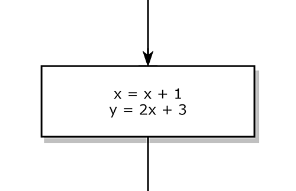
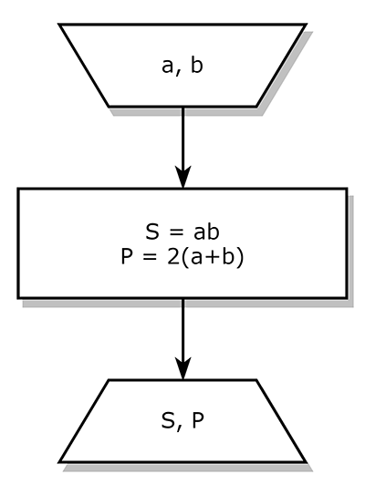
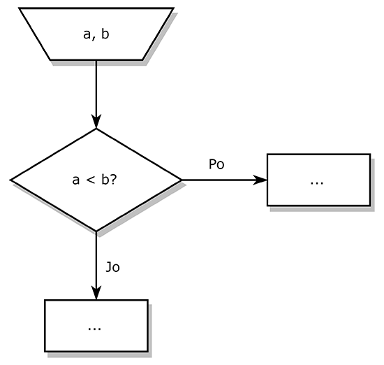
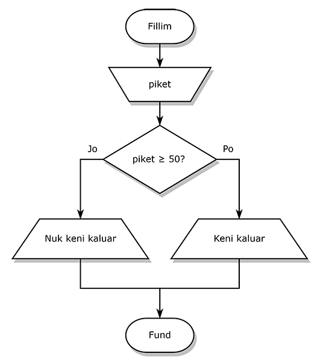

# Gjuhë Programuese - Java 3

---

## Përsëritje

1. Çka janë **tipet**?
2. Çka janë **variablat**?
3. Çka janë **shprehjet**?

--

1. **Tipi** është lloji i të dhënës, psh. tekst, numër, vërtetësi, etj.
2. **Variablat** na mundësojnë ruajtjen e të dhënave në memorie.
3. **Shprehje** është gjithçka që ka tip dhe vlerë.

---

## Formatimi, kushtëzimet, bllok diagramet

---

## Shtypja e formatuar

Në librarinë `<iomanip>` (input output manipulators) ekzistojnë disa manipulatorë për formatimin e daljes në `cout`.

---

<!-- .slide: style="font-size: 0.7em" -->

Manipulatori|Alternativa|Kuptimi
-|-|-
setw(n)|cout.width(n)|Shkruaj rezultatin në `n` karaktere, duke shtuar karaktere mbushëse (mostra) nëse ka nevojë.
setfill(c)|cout.fill(c)|Hapësirat e shtuara mbushi me karakterin `c` - mostrën.
setprecision(n)|cout.precision(n)|Kufizo numrat me presje në `n` shifra.
setbase(base)|-|Vendos bazën e numrave të shtypur.

---

**Mënyrat e precizitetit**

Supozojmë që streami (`cout`) ka precizitetin $n$. Kemi tri lloje të shfaqjes së numrave me presje.

1. default - kufizohet dalja në `n` shifra total (para dhe pas presjes).
2. **`std::fixed`** - kufizohet dalja në `n` shifra pas presjes. 
3. **`std::scientific`** - kufizohet dalja në `n` shifra pas presjes, ndërsa pjesa e plotë gjithmonë është 1 shifrore. Eksponenti përdoret për ta lëvizur presjen.

---

**Detyrë:** Të bëhet shkëmbimi i valutës nga euro (€) në dollar ($), nëse rata e këmbimit jepet nga tastiera. Rezultati të shfaqet në 2 shifra pas presjes.

```text
Jepni vleren ne euro: 250
Jepni raten e shkembimit: 1.16
Vlera ne dollar: $290.00
```

**Bonus:** Vlerës finale t'i zvogëlohet tarifa `2%` dhe të shfaqet në ekran.

---

**Detyrë:** Të shfaqen rezultatet e provimit në formë tabele si në vijim. Të përdoret manipulatori `setw` dhe `setfill`.

```text
 Lenda...................Nota
 Matematike................10
 Fizike.....................7
 Gjuhe Programuese..........8
```

**Bonus:** Vizatojeni me [box-drawing character](https://en.wikipedia.org/wiki/Box-drawing_character#DOS):

```text
╔══════════════════════╦════╗
║Lenda                 ║Nota║
╠══════════════════════╬════╣
║Matematike            ║  10║
║Fizike                ║   7║
║Gjuhe Programuese     ║   8║
╚══════════════════════╩════╝
```

---

## Shprehjet e vërtetësisë

Çdo gjë që ka përgjigjen **po** ose **jo** është **shprehje e vërtetësisë** (shprehje booleane).

---

## Operatorët e krahasimit

<!-- .slide: style="font-size: 0.7em" -->

Këta operatorë krahasojnë shprehjet dhe kthejnë vlerë booleane.

Operatori|Kuptimi
-|-
`a == b`|A janë të barabarta ana e majtë dhe e djathtë?
`a > b`|A është ana e majtë më e madhe se ana e djathtë?
`a >= b`|A është ana e majtë më e madhe ose baraz me anën e djathtë?
`a < b`|A është ana e majtë më e vogël se ana e djathtë?
`a <= b`|A është ana e majtë më e vogël ose baraz me anën e djathtë?

---

## Operatorët logjik

Veprojnë me **shprehje booleane**.

Operatori|Kuptimi
-|-
`a && b`|Kthen `true` kur **`a` dhe `b`** janë true.
`a ∣∣ b`|Kthen `true` kur **`a` ose `b`** janë true.
`!a`|Kthen të **kundërtën e `a`**.

---

Përparësia e operatorëve logjik:

1. Negacioni `!`
2. Dhe logjike `&&`
3. Ose logjike `||`

Përmes kllapave mund të caktojmë përparësi tjetër.

```cpp
a && !(b || c)
```

---

## Kushtëzimet

Mundësojnë ekzekutimin e një **blloku të urdhërave** vetëm nëse vlen kushti.

```cpp
if (kushti) {
  blloku;
}
```

Kushti duhet të jetë **shprehje e vërtetësisë** (bool).

--

**Rikujtim:** Bllok të kodit e quajmë vargun e urdhërave të mbështjellur me kllapa gjarpërore.

```cpp
{
  urdher;
  urdher;
  urdher;
}
```

---

**Shembull:**

```cpp
if (piket >= 50) {
  cout << "Keni kaluar provimin." << endl;
}
```

---

Kushtëzimi me dy degëzime:

```cpp
if (kushti) {
  blloku1;
} else {
  blloku2;
}
```

Nëse vlen **kushti**, ekzekutohet **blloku1**, nëse nuk vlen, ekzekutohet **blloku2**.

Nuk ka mundësi të ekzekutohen të dy blloqet përnjëheri - ose njëra ose tjetra.

---

**Detyrë:** Të kërkohet numri i pikëve nga tastiera (numër i plotë), dhe të tregohet nëse është kaluar provimi. Provimi kalohet me 50 ose më shumë pikë.

```text
Jepni piket: 67
Keni kaluar provimin
```

```text
Jepni piket: 32
Nuk keni kaluar provimin
```

**Bonus:** Të lexohen edhe pikët e provimit me gojë, dhe studenti kalon vetëm nëse të dyjat janë mbi 50.

---

**Detyrë:** Të lexohet nga tastiera një numër i plotë $x$. Të llogaritet dhe të shfaqet vlera $y$ sipas funksionit:

$$
y = \begin{cases}
2x - 3 & \text{kur}\; x \geq 7 \\
x^2 + 1 & \text{kur}\; x < 7
\end{cases}
$$

**Bonus:** Të shtohet rasti kur $x < 4,\; y = \frac{|x-1|}{2}$

---

**Operatori ternar (`?`)**

Kur kemi rastin e degëzimit si në vijim:

```cpp
if (kushti) {
  y = shprehja1;
} else {
  y = shprehja2;
}
```

Mund ta thjeshtojmë në:

```cpp
y = kushti ? shprehja1 : shprehja2;
```

---

$$
y = \begin{cases}
shprehja1 & \text{nëse}\; \textit{kushti} \\
shprehja2 & \text{nëse jo}
\end{cases}
$$

Shembull:

```cpp
int a, b, max;
cin >> a;
cin >> b;
max = a > b ? a : b;
cout << "Maksimumi është: " << max;
```

---

Kushtëzimi me shumë degë:

```cpp
if (kushti1) {
  blloku1;
} else if (kushti2) {
  blloku2;
} else if (kushti3) {
  blloku3;
} else {
  blloku4;
}
```

Ekzekutohet blloku i parë i cili përmbush kushtin përkatës. Nëse asnjëri kusht nuk përmbushet ekzekutohet blloku 4.

---

**Detyrë:** Të caktohet dhe të shfaqet nota varësisht nga numri i pikëve sipas tabelës:

Nota|Pikët
-|-
10|90+
9|80-89
8|70-79
7|60-69
6|50-59
5|Përfundi 50

---

**Detyrë:** Të lexohen dy numra të plotë nga tastiera. Të tregohet nëse të dy numrat janë pozitiv, të dytë negativ, të dytë zero, ose janë të përzier.

**Bonus:** Të tregohet nëse numrat janë të dytë çift, të dytë tek, ose të përzier.

---

## Bllok diagramet

E paraqesin algoritmin në formë vizuele.

---

Urdhërat paraqiten me drejtkëndësha:

 <!-- .element: style="border:none" -->

---

Hyrjet dhe daljet paraqiten me trapezoidët:

 <!-- .element: style="border:none" -->

---

Kushtëzimet paraqiten me romb:

 <!-- .element: style="border:none" -->

---

Figurat i lidhim me shigjeta për ta përshkruar **algoritmin** tonë.

**Algoritëm** - rregullat dhe hapat logjik të një programi.

---

 <!-- .element: style="border:none" -->

---

## Detyra shtesë

---

**Detyrë:** Të lexohen dy numra nga tastiera. Të shfaqet numri më i madh nga këta dy.

---

**Detyrë:** Të lexohet një karakter nga tastiera. Të tregohet nëse ky karakter është shkronjë e madhe (A-Z), shkronjë e vogël (a-z), apo diçka tjetër.

---

**Detyrë:** Të lexohet një numër i plotë nga tastiera, dhe të tregohet nëse ai numër është çift apo tek.

```text
Shtypni numrin: 7
Keni shtypur numer tek.
```

**Bonus:** Të vizatohet bllok diagrami i këtij programi.

---

**Detyrë:** Të lexohet një numër i plotë nga tastiera, dhe të shfaqet vlera absolute e tij.

```text
Shtypni numrin: -15
Vlera absolute e numrit: 15
```

**Bonus:** Të vizatohet bllok diagrami i këtij programi.

---

**Detyrë:** Të lexohen dy numra të plotë nga tastiera. Të tregohet nëse numrat janë të plotëpjestueshëm ndërmjet veti (nuk ka rëndësi cili me cilin).

```text
Shtypni a: 5
Shtypni b: 10
Numrat jane te plotepjestueshem.
```

```text
Shtypni a: 7
Shtypni b: 2
Numrat nuk jane te plotepjestueshem.
```

**Bonus:** Të vizatohet bllok diagrami i këtij programi.